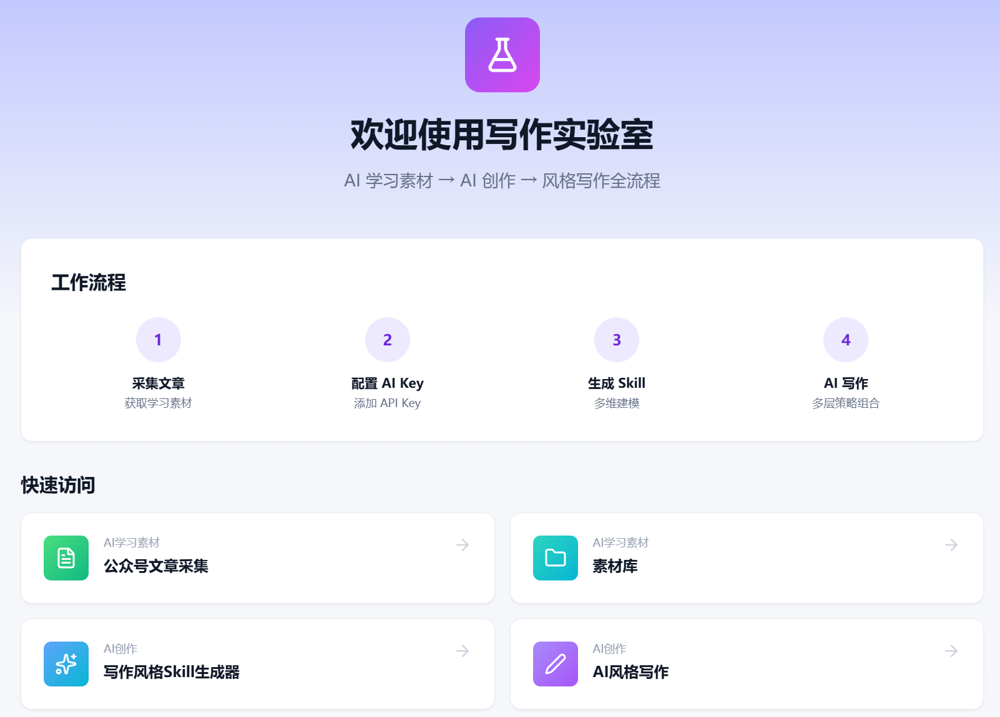
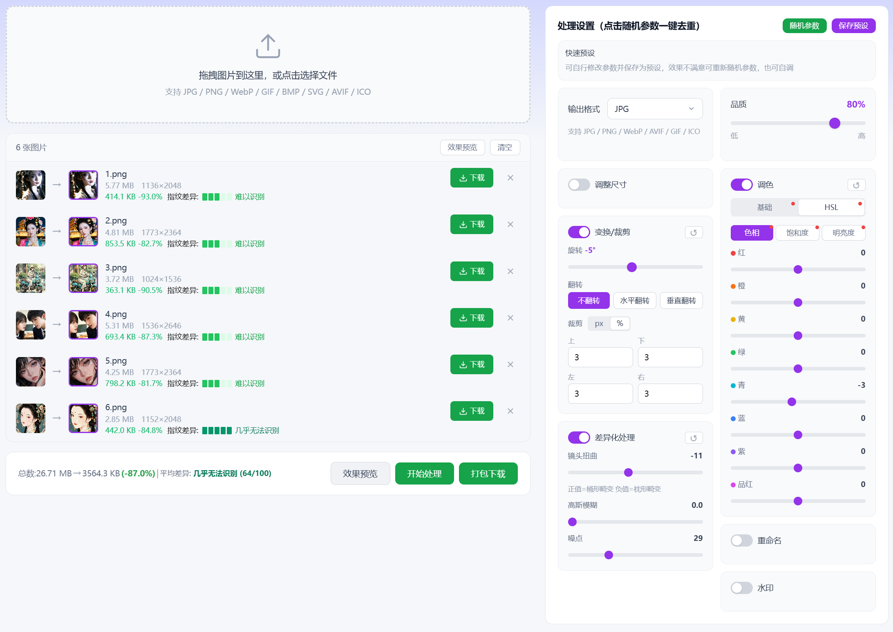

# 智子X

## 智子X，不是工具堆砌，是给创作者的一间实验室。

**这是一个线上实验室，是一个自媒体创作工具集，为内容创作者提供学习、研究和创作辅助**

> 智子X提供的工具（写作实验室、媒体解析、图片去重）都有明确的使用边界。

> 我们不追求“功能看起来很多”，而是追求“每个环节都真实可用”。从素材采集到风格建模，再到内容生成，智子X的目标始终是同一件事：让普通创作者轻松获得专业级创作能力。

[🚀前往智子X使用](https://zhizix.com)

---

## 快速导航

### 使用手册(功能说明)
- [扩展安装](https://github.com/zhiziX/zhiziX-extension) - 了解为何需要安装扩展
- [数据主权白皮书](docs/guide/data-ownership-whitepaper.md) - 了解智子X的隐私保护理念
### 写作实验室相关功能
- [自定义参数模板使用指南](docs/writer-lab/params-template-guide.md)
- [写作建模维度体系完整参考](docs/writer-lab/modeling-dimensions-reference.md)

---

## 🌟 全网首创的能力组合

智子X 不追求"功能数量"，而是追求"唯一性"。

### ✍️ 写作实验室：全网首个免费在线、Open Core的闭环工作流

- **公众号采集** — 用浏览器扩展直接从公众号后台采集下载文章，不经过服务器

- **风格建模** — 60+个参数量化作者写作特征（词汇层、句法层、修辞层、篇章层）

- **Skill 生成** — 把风格档案转化为 Skill + Style DNA（可复用的风格契约）

- **AI 风格写作** — 三层协同驱动：概率层（采样参数）+ 策略层（结构蓝图 + 反模板）+ 风格层（Style DNA），生成前约束，不是生成后洗稿

更重要的是，智子X的建模体系建立在语言学和NLP研究之上，智子X建立了完整的**14维建模体系，100+参数**：

- **6维AI自动提取**：表层风格、修辞手法、情感曲线、内容结构、认知模式、节奏韵律

- **8维用户创作决策**：读者定位、叙事视角、论证策略、特殊要求、文化语境、读者互动、多模态特征、内容深度

> 这不是"让AI模仿几句话"，而是把风格拆解到可量化、可复用、可控制的参数层面。

### 🖼️ 图片去重：全网首个免费在线带指纹对比检测的图片处理工具

> **别的在线工具只能简单裁剪调色，智子X把 Lightroom 级别的 HSL 调色和镜头扭曲搬到了浏览器里**

> **桌面级的处理能力，图片不上传服务器，保护隐私安全**

- **基础调色** — 色温、色调、曝光度、对比度、高光、阴影、饱和度、鲜艳度

- **HSL 精细调色** — 独立调整 8 个色相通道的色相/饱和度/明度

- **高级变换** — 旋转、裁剪、镜像翻转

- **差异化处理** — 噪点、高斯模糊、镜头扭曲（桶形/枕形畸变）

- **感知哈希指纹检测引擎** - 算法使用 Rust 编写并编译为 WebAssembly，在浏览器里光速计算。

> 这个工具多做了一步：**处理完自动告诉你，结果图和原图的差异有多大**。算法和主流内容平台同类。

### 🎬 媒体解析：全网首个免费在线扩展版多平台解析

> **用扩展直连平台，无限次数、高速、隐私保护。**

- **多平台支持** — B站、抖音、小红书、快手

- **哑管道架构** — 请求从你的浏览器直接发给平台，不经过服务器

> **技术边界声明：** 所有解析接口均基于浏览器可观察到的网页接口，不涉及 APP 破解。

> **为什么是首个？** 请阅读：[为什么智子X的媒体解析需要安装扩展？](docs/guide/why-parser-extension.md)了解智子X解析的技术原理

---

## 🔬 为什么叫”实验室”而不是”平台”

**平台 vs 实验室**

| 平台的逻辑 | 实验室的逻辑 |
|---------|----------|
| 提供标准化答案 | 提供方法论和工具 |
| 封装核心细节 | 关键逻辑透明可追踪 |
| 数据托管在服务器 | 数据优先留在用户本地 |
| 依赖订阅与锁定 | 核心能力免费 |

**实验室意味着：**
- **允许探索**
- **允许失败**
- **允许迭代**
- **Open Core理念** — 核心方法论、建模逻辑、实现方法全部公开在前端。

智子X 坚持：
- **免注册、开箱即用** — 浏览器添加扩展后，不需要注册账号，打开网页就能用

---

## ⚖️ 使用边界与价值观

**我们支持：**
- 采集【非原创内容】用于做学习素材或参考配图
- 个人学习研究、素材二创
- 提升创作效率、降低重复劳动
- 保护创作者的数据主权和隐私

**请合法使用：**
- 仅将下载的内容用于个人、非商业用途
- 在使用或分享内容前，获得内容所有者的许可
- 仅下载您有权下载的内容
- 遵守源平台的服务条款
- 尊重内容创作者的知识产权和版权

**禁止行为**
你不得：
- 下载受版权保护的内容用于商业目的（未经授权）
- 将下载的内容声称为你自己的原创作品

工具本身是中性的，但使用者的选择决定了它的价值。

我们希望智子X帮助的是那些真正想做自媒体的人，学习创作，又无从下手的人。

**智子X不储存/中转任何人的数据包括平台数据。**

**用户应对其使用本工具的行为及后果依法承担责任；对于用户违反法律法规或第三方权利的行为，智子X不承担相应责任。**

使用前请阅读[免责声明](docs/guide/disclaimer.md) 